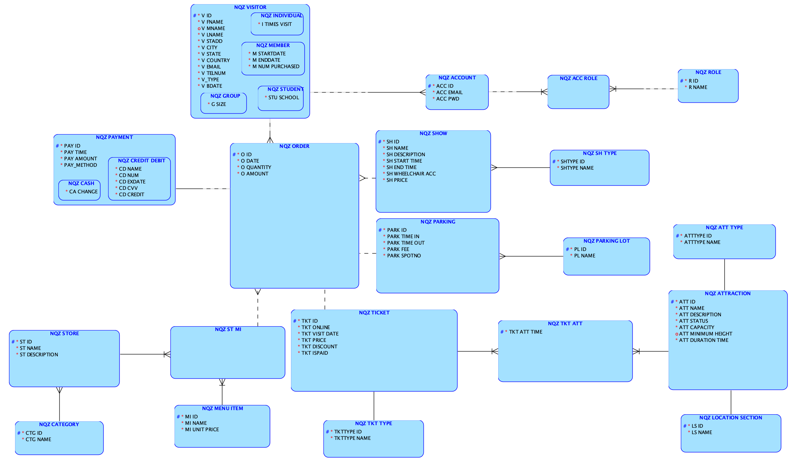
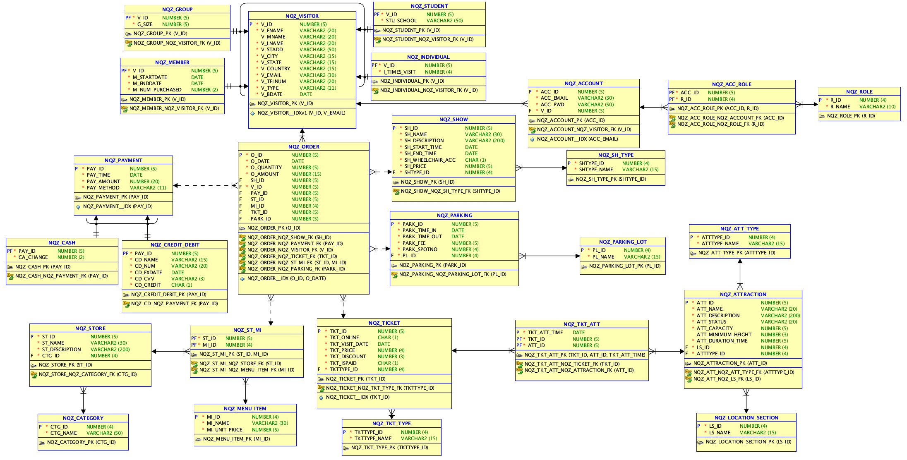

# File Structure

```
.
├── README.md
├── db
│   ├── DDL.ddl
│   ├── DDL.sql
│   ├── constraints.sql
│   ├── dic_query.sql
│   ├── insert.sql
│   └── records_num.sql
├── img
│   ├── logical.png
│   └── relational.png
├── mvnw
├── mvnw.cmd
├── pom.xml
├── src
│   ├── main
│   │   ├── java
│   │   │   └── com
│   │   │       └── nqz
│   │   │           └── voa
│   │   │               ├── VoaApplication.java
│   │   │               ├── configuration
│   │   │               │   ├── CorsConfig.java
│   │   │               │   └── SessionConfig.java
│   │   │               ├── controller
│   │   │               │   ├── AccountController.java
│   │   │               │   ├── AttractionController.java
│   │   │               │   ├── OrderController.java
│   │   │               │   ├── ParkingController.java
│   │   │               │   ├── PaymentController.java
│   │   │               │   ├── ShowController.java
│   │   │               │   ├── StoreController.java
│   │   │               │   ├── TicketController.java
│   │   │               │   └── VisitorController.java
│   │   │               ├── entry
│   │   │               │   ├── AccountEntry.java
│   │   │               │   ├── AttractionEntry.java
│   │   │               │   ├── AttractionTypeEntry.java
│   │   │               │   ├── CashPayEntry.java
│   │   │               │   ├── CategoryEntry.java
│   │   │               │   ├── CreditDebitPayEntry.java
│   │   │               │   ├── GroupRegisterRequestEntry.java
│   │   │               │   ├── GroupVisitEntry.java
│   │   │               │   ├── IndiRegisterRequestEntry.java
│   │   │               │   ├── IndividualVisitEntry.java
│   │   │               │   ├── LocationSectionEntry.java
│   │   │               │   ├── LoginRequestEntry.java
│   │   │               │   ├── MemberRegisterRequestEntry.java
│   │   │               │   ├── MemberVisitEntry.java
│   │   │               │   ├── MenuItemEntry.java
│   │   │               │   ├── OrderEntry.java
│   │   │               │   ├── ParkingEntry.java
│   │   │               │   ├── ParkingLotEntry.java
│   │   │               │   ├── PaymentEntry.java
│   │   │               │   ├── ProfileEntry.java
│   │   │               │   ├── RoleEntry.java
│   │   │               │   ├── ShowEntry.java
│   │   │               │   ├── ShowTypeEntry.java
│   │   │               │   ├── StoreEntry.java
│   │   │               │   ├── StuRegisterRequestEntry.java
│   │   │               │   ├── StudentVisitEntry.java
│   │   │               │   ├── TicketEntry.java
│   │   │               │   ├── TicketTypeEntry.java
│   │   │               │   └── VisitorEntry.java
│   │   │               ├── helper
│   │   │               │   └── Result.java
│   │   │               ├── mapper
│   │   │               │   ├── AccountMapper.java
│   │   │               │   ├── AttractionMapper.java
│   │   │               │   ├── HelperMapper.java
│   │   │               │   ├── OrderMapper.java
│   │   │               │   ├── ParkingMapper.java
│   │   │               │   ├── PaymentMapper.java
│   │   │               │   ├── ShowMapper.java
│   │   │               │   ├── StoreMapper.java
│   │   │               │   ├── TicketMapper.java
│   │   │               │   └── VisitorMapper.java
│   │   │               └── service
│   │   │                   ├── AccountService.java
│   │   │                   ├── AttractionService.java
│   │   │                   ├── HelperService.java
│   │   │                   ├── OrderService.java
│   │   │                   ├── ParkingService.java
│   │   │                   ├── PaymentService.java
│   │   │                   ├── ShowService.java
│   │   │                   ├── StoreService.java
│   │   │                   ├── TicketService.java
│   │   │                   ├── VisitorService.java
│   │   │                   └── impl
│   │   │                       ├── AccountServiceImpl.java
│   │   │                       ├── AttractionServiceImpl.java
│   │   │                       ├── HelperServiceImpl.java
│   │   │                       ├── OrderServiceImpl.java
│   │   │                       ├── ParkingServiceImpl.java
│   │   │                       ├── PaymentServiceImpl.java
│   │   │                       ├── ShowServiceImpl.java
│   │   │                       ├── StoreServiceImpl.java
│   │   │                       ├── TicketServiceImpl.java
│   │   │                       └── VisitorServiceImpl.java
│   │   └── resources
│   │       ├── application-dev.yml
│   │       └── application.properties
│   └── test
│       └── java
│           └── com
│               └── nqz
│                   └── voa
│                       └── VoaApplicationTests.java
└── target
    ├── classes
    │   ├── application-dev.yml
    │   ├── application.properties
    │   └── com
    │       └── nqz
    │           └── voa
    │               ├── VoaApplication.class
    │               ├── configuration
    │               │   ├── CorsConfig.class
    │               │   └── SessionConfig.class
    │               ├── controller
    │               │   ├── AccountController.class
    │               │   ├── AttractionController.class
    │               │   ├── OrderController.class
    │               │   ├── ParkingController.class
    │               │   ├── PaymentController.class
    │               │   ├── ShowController.class
    │               │   ├── StoreController.class
    │               │   ├── TicketController.class
    │               │   └── VisitorController.class
    │               ├── entry
    │               │   ├── AccountEntry.class
    │               │   ├── AttractionEntry.class
    │               │   ├── AttractionTypeEntry.class
    │               │   ├── CashPayEntry.class
    │               │   ├── CategoryEntry.class
    │               │   ├── CreditDebitPayEntry.class
    │               │   ├── GroupRegisterRequestEntry.class
    │               │   ├── GroupVisitEntry.class
    │               │   ├── IndiRegisterRequestEntry.class
    │               │   ├── IndividualVisitEntry.class
    │               │   ├── LocationSectionEntry.class
    │               │   ├── LoginRequestEntry.class
    │               │   ├── MemberRegisterRequestEntry.class
    │               │   ├── MemberVisitEntry.class
    │               │   ├── MenuItemEntry.class
    │               │   ├── OrderEntry.class
    │               │   ├── ParkingEntry.class
    │               │   ├── ParkingLotEntry.class
    │               │   ├── PaymentEntry.class
    │               │   ├── ProfileEntry.class
    │               │   ├── RoleEntry.class
    │               │   ├── ShowEntry.class
    │               │   ├── ShowTypeEntry.class
    │               │   ├── StoreEntry.class
    │               │   ├── StuRegisterRequestEntry.class
    │               │   ├── StudentVisitEntry.class
    │               │   ├── TicketEntry.class
    │               │   ├── TicketTypeEntry.class
    │               │   └── VisitorEntry.class
    │               ├── helper
    │               │   └── Result.class
    │               ├── mapper
    │               │   ├── AccountMapper.class
    │               │   ├── AttractionMapper.class
    │               │   ├── HelperMapper.class
    │               │   ├── OrderMapper.class
    │               │   ├── ParkingMapper.class
    │               │   ├── PaymentMapper.class
    │               │   ├── ShowMapper.class
    │               │   ├── StoreMapper.class
    │               │   ├── TicketMapper.class
    │               │   └── VisitorMapper.class
    │               └── service
    │                   ├── AccountService.class
    │                   ├── AttractionService.class
    │                   ├── HelperService.class
    │                   ├── OrderService.class
    │                   ├── ParkingService.class
    │                   ├── PaymentService.class
    │                   ├── ShowService.class
    │                   ├── StoreService.class
    │                   ├── TicketService.class
    │                   ├── VisitorService.class
    │                   └── impl
    │                       ├── AccountServiceImpl.class
    │                       ├── AttractionServiceImpl.class
    │                       ├── HelperServiceImpl.class
    │                       ├── OrderServiceImpl.class
    │                       ├── ParkingServiceImpl.class
    │                       ├── PaymentServiceImpl.class
    │                       ├── ShowServiceImpl.class
    │                       ├── StoreServiceImpl.class
    │                       ├── TicketServiceImpl.class
    │                       └── VisitorServiceImpl.class
    └── generated-sources
        └── annotations

35 directories, 161 files
```


# Install & Run
- Dependencies:
    - Java SDK 17
    - Spring Boot Web
    - Maven
    - MySQL Local Sever (XAMPP, MySQL Workbench)
- Please init the database use files inside the folder`/voa/db`
- Make sure your sql server is running at port 3306, or you could change the sql server URL in file `./resources/application-dev.yml`
- Build the project and run `VoaApplication.java`
- The server is running on port 8080 by default.

# Example Request URL
- `localhost:8080/account/member/register` Register an account for a member user.
- `localhost:8080/account/login` Login to the website.
- `localhost:8080/account/profile` Get the profile for the current user. 
- `localhost:8080/visitor/list` List all visitors (Need login, need admin permission).
- `localhost:8080/account/logout` Logout for the current user. 
- Please refer to `./controller` for more API endpoints. 

# Features

- RESTful API
- Prevent SQL injection using Mybatis PreparedStatement
- Use cookie/cache to store account information
- Request validation
- Password Encryption
- Session evaluation for identification
- Use Mybatis to connect Java webserver to database

# Database Designs
### Logical Model

### Relational Model

